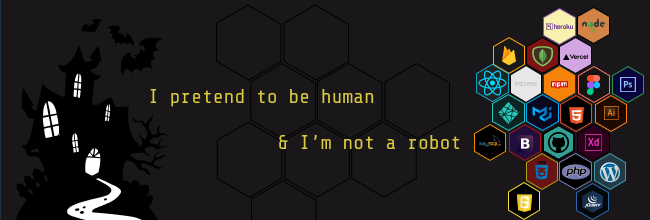

***

***

hello, 
I'm arif and I'm interested in software development. I started from html css and found myself developing flutter mobile apps. Currently, I'm working as a web developer at freelancing marketplace. In multiverse, I'm from CSE background and graduated from North South University. :))

***
<h3 align="right">You can find me on-</h3>

  
  
  
  
  
  
  
  
  
  

***

**Hold your breathe and take a look to my <a href="https://www.fiverr.com/arifjawad241" text-decoration="none">Fiverr</a>**

**visit my website :  <a href="https://arif-jawad.com" text-decoration="none">arif-jawad.com</a>**

***Here's something I have on github-***
 
 

  <h2 align="center">Overall stats</h2>

  

  

 

   
   

***
**Featured Repos-**

  
  

